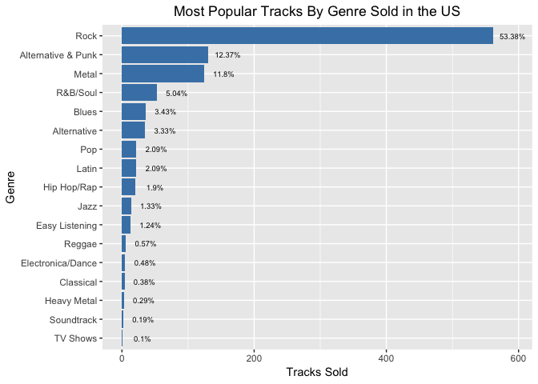
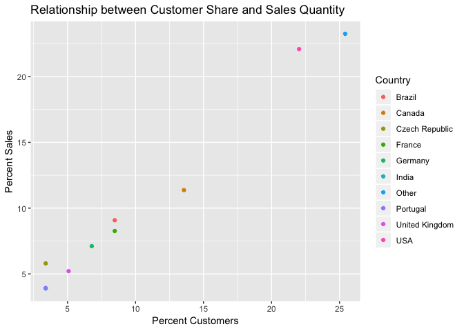

## Getting Started


```r
library(RSQLite)
library(DBI)
library(kableExtra)
library(tidyverse)
library(dbplyr)
library(magrittr)
```

Make a connection between the database and R.


```r
working_dir <- "/Users/roberthazell/Desktop/Dataquest/Chinook"
setwd(working_dir)
con <- DBI::dbConnect(RSQLite::SQLite(), dbname = paste(c(working_dir, "/chinook.db"), collapse = ''))
```

Take a look at the tables.


```r
dbListTables(con)
```

```
 [1] "album"          "artist"         "customer"       "employee"      
 [5] "genre"          "invoice"        "invoice_line"   "media_type"    
 [9] "playlist"       "playlist_track" "track"         
```

Now we need to create a ```tbl``` of each table and then convert each to a ```data.frame```.  This can be done by defining functions that create names for each table and assigns each of them to the respective table-turned-```data.frame```.


```r
# retrieve the tables
chinook_tables_list <- dbListTables(con)
# create table names by appending "_db" to each name
table_names <- map_chr(chinook_tables_list, 
                       function(t) {paste(c(t, "_db"), collapse = "")})
# create data frames from each table
chinook_dfs <- map(chinook_tables_list, 
                      function(t) {tbl(con,t) %>% as.data.frame()})
# link the table names to the tables, respectively
names(chinook_dfs) <- table_names
# attach to reference each table without calling chinook_tables
attach(chinook_dfs)
```

## Selecting Albums to Purchase

The Chinook record store has just signed a deal with a new record label, and the task is to select the first three albums that will be added to the store from a list of four.  All four albums are by artists that don't have any tracks in the store right now - we have the artist names, and the genre of music they produce.

<table class="table table-striped" style="width: auto !important; margin-left: auto; margin-right: auto;">
 <thead>
  <tr>
   <th style="text-align:center;"> Artist Name </th>
   <th style="text-align:center;"> Genre </th>
  </tr>
 </thead>
<tbody>
  <tr>
   <td style="text-align:center;"> Regal </td>
   <td style="text-align:center;"> Hip-Hop </td>
  </tr>
  <tr>
   <td style="text-align:center;"> Red Tone </td>
   <td style="text-align:center;"> Punk </td>
  </tr>
  <tr>
   <td style="text-align:center;"> Meteor and the Girls </td>
   <td style="text-align:center;"> Pop </td>
  </tr>
  <tr>
   <td style="text-align:center;"> Slim Jim Bites </td>
   <td style="text-align:center;"> Blues </td>
  </tr>
</tbody>
</table>

The record label specializes in artists from the USA, and they have given Chinook some money to advertise the new albums in the USA, so we're interested in finding out which genres sell the best in the USA.  The following query answers this question.


```r
genres_USA <- genre_db %>% 
  inner_join(track_db, by = 'genre_id', suffix = c("_genre", "_track")) %>%
  inner_join(invoice_line_db, by = 'track_id', suffix = c("_track", "_invoice_line")) %>%
  inner_join(invoice_db, by = 'invoice_id')

# make sure no column names are duplicated
any(duplicated(colnames(genres_USA)))
```

```
[1] FALSE
```

```r
# create the summary
genres_USA_summary <- genres_USA %>% 
  group_by('Genre'= name_genre) %>% 
  filter(billing_country == "USA") %>%
  summarise(Total = length(Genre)) %>%
  arrange(desc(Total)) %>% 
  mutate('Percent Sold' = round(Total/sum(Total) * 100, 2))

# create formatted table of results
genres_USA_summary %>% 
  kable(align = rep('c',3)) %>% 
  kable_styling(bootstrap_options = "striped", full_width = F)
```

<table class="table table-striped" style="width: auto !important; margin-left: auto; margin-right: auto;">
 <thead>
  <tr>
   <th style="text-align:center;"> Genre </th>
   <th style="text-align:center;"> Total </th>
   <th style="text-align:center;"> Percent Sold </th>
  </tr>
 </thead>
<tbody>
  <tr>
   <td style="text-align:center;"> Rock </td>
   <td style="text-align:center;"> 561 </td>
   <td style="text-align:center;"> 53.38 </td>
  </tr>
  <tr>
   <td style="text-align:center;"> Alternative &amp; Punk </td>
   <td style="text-align:center;"> 130 </td>
   <td style="text-align:center;"> 12.37 </td>
  </tr>
  <tr>
   <td style="text-align:center;"> Metal </td>
   <td style="text-align:center;"> 124 </td>
   <td style="text-align:center;"> 11.80 </td>
  </tr>
  <tr>
   <td style="text-align:center;"> R&amp;B/Soul </td>
   <td style="text-align:center;"> 53 </td>
   <td style="text-align:center;"> 5.04 </td>
  </tr>
  <tr>
   <td style="text-align:center;"> Blues </td>
   <td style="text-align:center;"> 36 </td>
   <td style="text-align:center;"> 3.43 </td>
  </tr>
  <tr>
   <td style="text-align:center;"> Alternative </td>
   <td style="text-align:center;"> 35 </td>
   <td style="text-align:center;"> 3.33 </td>
  </tr>
  <tr>
   <td style="text-align:center;"> Latin </td>
   <td style="text-align:center;"> 22 </td>
   <td style="text-align:center;"> 2.09 </td>
  </tr>
  <tr>
   <td style="text-align:center;"> Pop </td>
   <td style="text-align:center;"> 22 </td>
   <td style="text-align:center;"> 2.09 </td>
  </tr>
  <tr>
   <td style="text-align:center;"> Hip Hop/Rap </td>
   <td style="text-align:center;"> 20 </td>
   <td style="text-align:center;"> 1.90 </td>
  </tr>
  <tr>
   <td style="text-align:center;"> Jazz </td>
   <td style="text-align:center;"> 14 </td>
   <td style="text-align:center;"> 1.33 </td>
  </tr>
  <tr>
   <td style="text-align:center;"> Easy Listening </td>
   <td style="text-align:center;"> 13 </td>
   <td style="text-align:center;"> 1.24 </td>
  </tr>
  <tr>
   <td style="text-align:center;"> Reggae </td>
   <td style="text-align:center;"> 6 </td>
   <td style="text-align:center;"> 0.57 </td>
  </tr>
  <tr>
   <td style="text-align:center;"> Electronica/Dance </td>
   <td style="text-align:center;"> 5 </td>
   <td style="text-align:center;"> 0.48 </td>
  </tr>
  <tr>
   <td style="text-align:center;"> Classical </td>
   <td style="text-align:center;"> 4 </td>
   <td style="text-align:center;"> 0.38 </td>
  </tr>
  <tr>
   <td style="text-align:center;"> Heavy Metal </td>
   <td style="text-align:center;"> 3 </td>
   <td style="text-align:center;"> 0.29 </td>
  </tr>
  <tr>
   <td style="text-align:center;"> Soundtrack </td>
   <td style="text-align:center;"> 2 </td>
   <td style="text-align:center;"> 0.19 </td>
  </tr>
  <tr>
   <td style="text-align:center;"> TV Shows </td>
   <td style="text-align:center;"> 1 </td>
   <td style="text-align:center;"> 0.10 </td>
  </tr>
</tbody>
</table>

Here's a bar plot summarizing this information.


```r
ggplot(genres_USA_summary, aes(x = reorder(Genre, Total), y = Total)) + 
  geom_bar(fill = 'steel blue', stat = "identity") +
  coord_flip() + 
  geom_text(aes(label = paste0(`Percent Sold`, '%')), 
                size = 2.5, nudge_y = 30) +
  ggtitle("Most Popular Tracks By Genre Sold in the US") +
  ylab("Tracks Sold") + 
  xlab("Genre") +
  theme(plot.title = element_text(hjust = 0.5))
```

<!-- -->

Based on the sales of tracks across different genres in the USA, we should purchase the new albums by the following artists:

* Red Tone (Punk)
* Slim Jim Bites (Blues)
* Meteor and the Girls (Pop)

It's worth noting that combined, these three genres only make up only 17% of total sales, so we should be on the lookout for artists and albums from the 'Rock' genre, which accounts for over 53% of sales.

## Analyzing Employee Sales Performance

Each customer of the Chinook store gets assigned to a sales support agent within the company when they first make a purchase. Management requests an analysis of customer purchases belonging to each employee to see if any sales support agent is performing either better or worse than the others.

One method is to determine how many sales an employee generates, and this requires joining the ```employee_db```, ```customer_db```, and ```invoice_db``` tables together. 


```r
# make a copy of employee_db to prevent repeated appending of _emp
# IOW, need a reference to an unaltered version
# use employee_db2 for analysis
employee_db2 = employee_db[,]
colnames(employee_db2)[2:15] %<>% map(.,function(t) {paste0(t, "_emp")})

# now join and summarise
employee_db2 %>%
  inner_join(customer_db, by = c('employee_id' = 'support_rep_id')) %>%
  inner_join(invoice_db, by = 'customer_id') %>%
  select(employee_id:first_name_emp, total, hire_date_emp) %>%
  group_by(employee_id, last_name_emp, first_name_emp, hire_date_emp) %>%
  summarise(`Total Sales ($)` = sum(total)) %>%
  unite("Employee Name", c("first_name_emp", "last_name_emp"), sep=" ") %>%
  arrange(desc(`Total Sales ($)`)) %>%
  as.data.frame()
```

```
  employee_id Employee Name       hire_date_emp Total Sales ($)
1           3  Jane Peacock 2017-04-01 00:00:00         1731.51
2           4 Margaret Park 2017-05-03 00:00:00         1584.00
3           5 Steve Johnson 2017-10-17 00:00:00         1393.92
```

```r
# default structure is a tibble, but won't diplay decimals when knit
# converted to data frame to solve that issue
```

We can see that only three employees work at Chinook. Jane, who has the most sales, is also the longest hired among the three.

## Analyzing Sales by Country

Next up to analyze is sales data for customers from each different country.  The deliverable should contain:

* total number of customers
* total value of sales

Management would like to classify all countries with only one customer to its own category 'Other', with the same statistics above. 

Here's the query.


```r
# preliminary summary
country_summary <- customer_db %>%
  inner_join(invoice_db, by = 'customer_id') %>%
  group_by(Country = country) %>%
  summarise('Total Customers' = length(unique(customer_id)),
            'Total Sales' = sum(total)) %>%
  arrange(desc(`Total Customers`))

# summary for countries with only 1 customer
only_one <- country_summary %>% 
  filter(`Total Customers` == 1) %>% 
  summarise(Country = 'Other',
    `Total Customers` = sum(`Total Customers`),
    `Total Sales` = sum(`Total Sales`))

# final query
chinook_by_country <- country_summary %>% 
  filter(!`Total Customers` == 1) %>%
  rbind(only_one) %>%
  mutate(`Percent Sales` = 
           round(`Total Sales`/sum(`Total Sales`) * 100, 2),
         `Percent Customers` = round(`Total Customers`/sum(`Total Customers`)*100, 2)) %>%
  as.data.frame() 

chinook_by_country %>%
  kable(align = rep('c', 5)) %>% 
  kable_styling(bootstrap_options = "striped", full_width = F)
```

<table class="table table-striped" style="width: auto !important; margin-left: auto; margin-right: auto;">
 <thead>
  <tr>
   <th style="text-align:center;"> Country </th>
   <th style="text-align:center;"> Total Customers </th>
   <th style="text-align:center;"> Total Sales </th>
   <th style="text-align:center;"> Percent Sales </th>
   <th style="text-align:center;"> Percent Customers </th>
  </tr>
 </thead>
<tbody>
  <tr>
   <td style="text-align:center;"> USA </td>
   <td style="text-align:center;"> 13 </td>
   <td style="text-align:center;"> 1040.49 </td>
   <td style="text-align:center;"> 22.09 </td>
   <td style="text-align:center;"> 22.03 </td>
  </tr>
  <tr>
   <td style="text-align:center;"> Canada </td>
   <td style="text-align:center;"> 8 </td>
   <td style="text-align:center;"> 535.59 </td>
   <td style="text-align:center;"> 11.37 </td>
   <td style="text-align:center;"> 13.56 </td>
  </tr>
  <tr>
   <td style="text-align:center;"> Brazil </td>
   <td style="text-align:center;"> 5 </td>
   <td style="text-align:center;"> 427.68 </td>
   <td style="text-align:center;"> 9.08 </td>
   <td style="text-align:center;"> 8.47 </td>
  </tr>
  <tr>
   <td style="text-align:center;"> France </td>
   <td style="text-align:center;"> 5 </td>
   <td style="text-align:center;"> 389.07 </td>
   <td style="text-align:center;"> 8.26 </td>
   <td style="text-align:center;"> 8.47 </td>
  </tr>
  <tr>
   <td style="text-align:center;"> Germany </td>
   <td style="text-align:center;"> 4 </td>
   <td style="text-align:center;"> 334.62 </td>
   <td style="text-align:center;"> 7.11 </td>
   <td style="text-align:center;"> 6.78 </td>
  </tr>
  <tr>
   <td style="text-align:center;"> United Kingdom </td>
   <td style="text-align:center;"> 3 </td>
   <td style="text-align:center;"> 245.52 </td>
   <td style="text-align:center;"> 5.21 </td>
   <td style="text-align:center;"> 5.08 </td>
  </tr>
  <tr>
   <td style="text-align:center;"> Czech Republic </td>
   <td style="text-align:center;"> 2 </td>
   <td style="text-align:center;"> 273.24 </td>
   <td style="text-align:center;"> 5.80 </td>
   <td style="text-align:center;"> 3.39 </td>
  </tr>
  <tr>
   <td style="text-align:center;"> India </td>
   <td style="text-align:center;"> 2 </td>
   <td style="text-align:center;"> 183.15 </td>
   <td style="text-align:center;"> 3.89 </td>
   <td style="text-align:center;"> 3.39 </td>
  </tr>
  <tr>
   <td style="text-align:center;"> Portugal </td>
   <td style="text-align:center;"> 2 </td>
   <td style="text-align:center;"> 185.13 </td>
   <td style="text-align:center;"> 3.93 </td>
   <td style="text-align:center;"> 3.39 </td>
  </tr>
  <tr>
   <td style="text-align:center;"> Other </td>
   <td style="text-align:center;"> 15 </td>
   <td style="text-align:center;"> 1094.94 </td>
   <td style="text-align:center;"> 23.25 </td>
   <td style="text-align:center;"> 25.42 </td>
  </tr>
</tbody>
</table>

Now we can visualize the relationship between customers and sales across all countries.


```r
ggplot(chinook_by_country, 
       aes(`Percent Customers`, `Percent Sales`, color = Country)) +
  geom_point() + 
  xlab("Percent Customers") + 
  ylab("Percent Sales") +
  ggtitle("Relationship between Customer Share and Sales Quantity")
```

<!-- -->

Larger customer shares generally lend to higher sales  That may seem obvious, but it's not always the case.  It's possible to have many customers that buy little, and few customers that comprise the majority of sales.  Also, no causal relationship can be inferred.  If you look closely, there are 10 countries in the legend but it seems only 9 are plotted  This is because India and Portugal virtually overlap; see the above table for their values.

## Albums vs Individual Tracks

The Chinook store is setup in a way that allows customer to make purchases in one of the two ways:

* purchase a whole album
* purchase a collection of one or more individual tracks.

The store does not let customers purchase a whole album, and then add individual tracks to that same purchase (unless they do that by choosing each track manually). When customers purchase albums they are charged the same price as if they had purchased each of those tracks separately.

Management are currently considering changing their purchasing strategy to save money. The strategy they are considering is to purchase only the most popular tracks from each album from record companies, instead of purchasing every track from an album.

We have been asked to find out what percentage of purchases are individual tracks vs whole albums, so that management can use this data to understand the effect this decision might have on overall revenue.

To solve this, we need to identify whether each invoice has all the tracks from an album. To do that we need to find the number of tracks in each album and compare that value to the number of tracks that were purchased.

#### Step 1: Find the corresponding ```album_id``` for each track purchased in the ```invoice_line``` table.


```r
# get corresponding album_id for each track in the invoice
invl_tr <- invoice_line_db %>% 
  inner_join(track_db, by = 'track_id', 
             suffix = c('_inv', '_track')) %>%
  select("invoice_id":"quantity", "album_id")
```

#### Step 2: Find the number of tracks in each album.


```r
# number of tracks in each album
alb_trk <- track_db %>% 
  group_by(album_id) %>% 
  summarise(n_tracks = length(album_id))
```

#### Step 3: Find the number of tracks purchased from each album.


```r
#  find the number of tracks purchased from each album in the invoice
tracks_purchased <- invl_tr %>% 
  group_by(invoice_id, album_id) %>% 
  summarise(n_tracks = length(album_id)) %>%
  arrange(album_id)
```

#### Step 4: Compare the number of tracks in each album from Step 2 to the number of tracks purchased for each album from Step 3.


```r
# purchases containing fewer tracks than the album
single_tracks <- tracks_purchased %>% 
  anti_join(alb_trk, by = c("album_id", 'n_tracks'))

length(unique(single_tracks$invoice_id))
```

```
[1] 500
```

```r
# purchases containing all tracks from the album
album_purchase <- tracks_purchased %>%
  semi_join(alb_trk, by = c("album_id", 'n_tracks'))

length(unique(album_purchase$invoice_id))
```

```
[1] 200
```

So there are 500 singles and 200 album purchases.  But wait, how can that be?  There are only 614 unique ```invoice_id```s.  


```r
length(unique(invoice_line_db$invoice_id))
```

```
[1] 614
```

The reason is that some people purchased *both* albums and singles.  This is true since there are duplicate ```invoice_id```s for each purchase category


```r
# get the invoice_if for each category
single_purchases <- unique(single_tracks$invoice_id)
album_purchases <- unique(album_purchase$invoice_id)

# check for duplicates
intersect(single_purchases, album_purchases)
```

```
 [1]  67 421 423 462 548 579  97 210 565 586  78 121 270 311 324 345 415
[18] 434 509 517 527 577   7  94 111 137 306 597  20 168 195 242 272 288
[35] 101 260 486  91 265 285  38  41 384 467 365  39  59 134 275 437 445
[52] 250 450 216 106 227 369 405 452  11  37   4 395  15 190 218 164 176
[69] 368 428 103 316 441  87 127 198 402 180  27 313 256 424 338 325 189
[86] 360
```

There are 86 customers who purchased both albums and singles.  This means 500-86 = 414 people made singles-only purchases and 200-86 = 114 made album-only purchases.  Since album-only purchases comprise just 18.6% of customers, I would recommend against purchasing only select tracks from albums from record companies, since there is potential to lose nearly one fifth of revenue.


